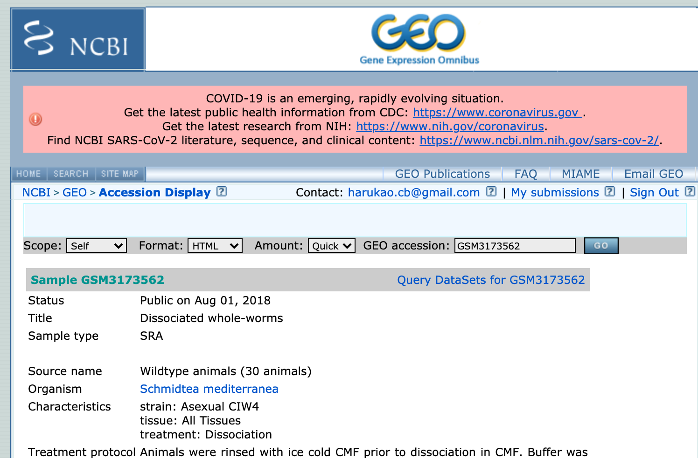

# 演習B

- [演習B](#演習b)
  - [何をやるの？](#何をやるの)
    - [プラナリア？](#プラナリア)
    - [どんなデータ？](#どんなデータ)
  - [1. データのありかにアクセスし、ダウンロードリンクを得る](#1-データのありかにアクセスしダウンロードリンクを得る)
  - [2. 必要なファイルをダウンロードする](#2-必要なファイルをダウンロードする)
  - [3. Seurat でコードを実行する](#3-seurat-でコードを実行する)
  - [基本課題](#基本課題)
    - [基本課題B-1](#基本課題b-1)
  - [発展課題](#発展課題)
    - [発展課題B-1](#発展課題b-1)
    - [発展課題B-2](#発展課題b-2)

## 何をやるの？

- プラナリアの一細胞RNA-seqデータを解析します

### プラナリア？

- 切っても再生する生き物
- https://en.wikipedia.org/wiki/Schmidtea_mediterranea


### どんなデータ？

- 元論文
  - Comparative transcriptomic analyses and single-cell RNA sequencing of the freshwater planarian Schmidtea mediterranea identify major cell types and pathway conservation https://genomebiology.biomedcentral.com/articles/10.1186/s13059-018-1498-x
  - freshwater planarian *Schmidtea mediterranea*
  - Drop-seq
- プラナリアの scRNA-seq データ解析
  - https://www.ncbi.nlm.nih.gov/geo/query/acc.cgi?acc=GSE115280
  - cluster markers https://figshare.com/articles/Additional_file_4/6852896
  - https://genomebiology.biomedcentral.com/articles/10.1186/s13059-018-1498-x


## 1. データのありかにアクセスし、ダウンロードリンクを得る

- GEO (Gene Expression Omnibus) は米国NCBIが運営する、マイクロアレイやNGSデータのデータレポジトリ


[https://www.ncbi.nlm.nih.gov/geo/query/acc.cgi?acc=GSE115280](https://www.ncbi.nlm.nih.gov/geo/query/acc.cgi?acc=GSM3173562)にアクセスすると、こんなページが出る



下の方にスクロールし、 `(ftp)` を **右クリック** し（Macの場合はctrl+クリックも可）、リンクのアドレスをコピーする


## 2. 必要なファイルをダウンロードする

ターミナルを開き、以下を実行する

```bash
# data というディレクトリへ移動する
$ cd data

# ダウンロードする
$ wget ftp://ftp.ncbi.nlm.nih.gov/geo/samples/GSM3173nnn/GSM3173562/suppl/GSM3173562_Lakshmipuram_NCBI_processeddata.txt.gz

# 解凍する
$ gunzip GSM3173562_Lakshmipuram_NCBI_processeddata.txt.gz
```

```bash
# 行数を調べる
$ wc -l GSM3173562_Lakshmipuram_NCBI_processeddata.txt

# 中身を見てみる
$ less GSM3173562_Lakshmipuram_NCBI_processeddata.txt
```

## 3. Seurat でコードを実行する

[planarian_single_cell.ipynb](planarian_single_cell.ipynb) の内容を実行する

## 基本課題

### 基本課題B-1

- [planarian_single_cell.ipynb](planarian_single_cell.ipynb) をダウンロードし、実行せよ
- 上のメニューから `File > Download as > PDF (.pdf)` とすることで、実行結果をダウンロードできるので、それを manaba で提出せよ

## 発展課題

### 発展課題B-1

- 各クラスターに特異的な遺伝子群がどのような機能を持つ遺伝子かを調べ、レポートとしてまとめよ
  - 少なくとも３つのクラスターについて調べよ
- 様式は以下の通りにする。様式が満たされていない場合は０点とする。
  - ファイル形式：Word
  - ページ数：２ページ以内（ギリギリまで書いた方が成績が良いという意味ではない、例えば２ページでも満点になりうる）
  - フォント：サイズは 10ポイント、そのほかは自由
  - 構成：
    - タイトル
    - 氏名
    - 学籍番号
    - 目的（本課題の目的を書く）
    - 方法
    - 結果（どんな遺伝子が多かったか）
    - 考察（結果がこれまで）
    - 結論（目的を達成できたかを結果に基づいて書く）


### 発展課題B-2

- この論文 https://doi.org/10.1016/j.bbrc.2020.03.044 ではヒトの13の組織において ACE2など SARS-COV2 の感染に関連する受容体の発現を調査している
- Table S1 (Excelファイル) を参考に好きな組織の１細胞RNA-seqデータをダウンロードし、 [planarian_single_cell.ipynb](planarian_single_cell.ipynb) を参考に、データ前処理・解析を行い、ACE2遺伝子の発現量が高い細胞があるかを調べよ
- 上のメニューから `File > Download as > PDF (.pdf)` とすることで、実行結果をダウンロードできるので、それを manaba で提出せよ
